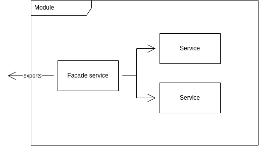

# Facade Pattern

Facade pattern hides the complexities of the system and provides an interface to the client using which the client can access the system. This type of design pattern comes under structural pattern as this pattern adds an interface to existing system to hide its complexities.

Facade discusses encapsulating a complex subsystem within a single interface object. This reduces the learning curve necessary to successfully leverage the subsystem. It also promotes decoupling the subsystem from its potentially many clients. On the other hand, if the Facade is the only access point for the subsystem, it will limit the features and flexibility that "power users" may need.

  

NestJS modules can also have interface that other modules can use. Via `exports` you can manipulate which functions your modules offer to use

1. Create your logic in services. Example in [NotificationsEmailService](./src/modules/notifications/services/notifications-email.service.ts)
2. Create Facade service (or API Service) that will be exported from your module. Example in [NotificationsFacadeService](./src/modules/notifications/services/notifications-facade.service.ts)
3. Export your facade (api) service from your module. Example in [NotificationsModule](./src/modules/notifications/notifications.module.ts)

That's very helpful to understand what API your module has, especially when you work in a big team.

| Bad                                                                                  | Good                                                                                                                       |
| ------------------------------------------------------------------------------------ | -------------------------------------------------------------------------------------------------------------------------- |
| Exports all services and gives developers basic functions without any logic usecases | To make a complex subsystem easier to use, a simple interface should be provided for a set of interfaces in the subsystem. |
