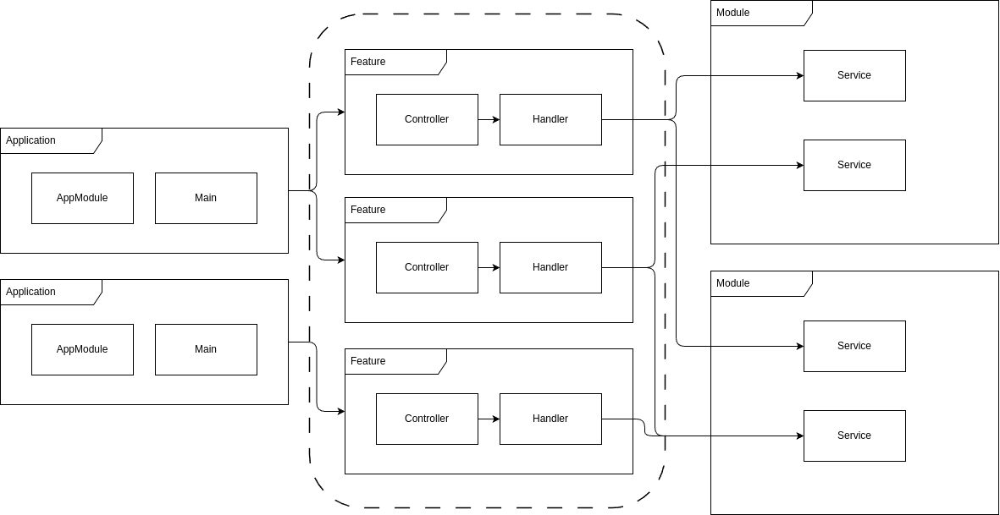

# Vertical Slicing Architecture

Vertical Slice Architecture is an approach to code organization in which an application is divided into independent functional slice. Each slice includes all the necessary components to implement a certain function, from the user interface to the database. Unlike traditional layered architectures, where layers are divided by technical aspects, vertical architecture organizes code around business features or user scenarios.

  

> To understand how to use vertical slicing, you need to know what business and domain logic is. Properly slice your logic into modules and features to get full benefit of VSA.

In NestJS your features is all business logic that depends on your application needs. In code example I created UsersModule and 2 features: sign up command and get user query. Sign up command is a business feature which use `createUser()` function in UserModules. While `signUp()` is a feature, `createUser()` is a domain function. 

**Important:** Do not store any controllers, crons, onModuleInit hooks in your domain modules. They are designed to use in multiple nestjs services to split your features easily

This design pattern gives you
- High cohesion: All the elements needed to implement the function are in one place, making them easy to understand and change.
- Low coupling: 'slices' loosely depend on each other, simplifying changes and testing.
- Modularity: New features can be added as new slices without affecting existing code.
- Scalability: You can easily transfer your features to other NestJS services (Kubernetes friendly)
- CQRS Friendly: You can use CQRS pattern and split your features on command and queries

| **Bad** | **Good** |
|---|---|
| Store crons, controllers, init hooks in NestJS domain modules | To make a complex service easier to scale, crons, controllers, init hooks should be stored in features layer |
| One feature use another feature | Never create dependencies via your features. Feature is independent, atomic function in your service. If you want to chain your features properly check out SAGA pattern |
| Commands return a lot of data | Check out CQRS pattern to understand why your commands should not return data. I return ids or some command return value info (for example: [tokens in signUp feature](./src/features/sign-up/sign-up.command.ts)) |
